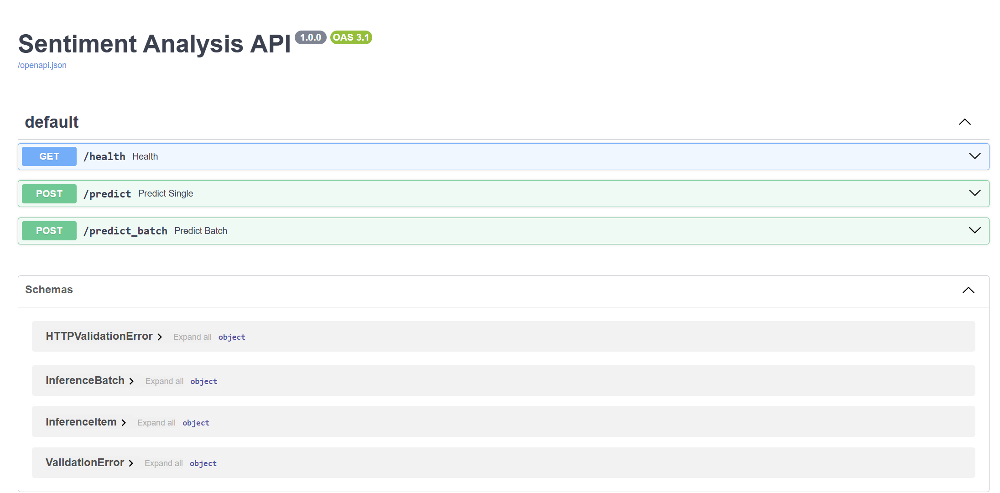

# Sentiment Analysis API 
[](https://github.com/<OWNER>/<REPO>/actions/workflows/deploy-azure.yml)

This project demonstrates how to **build, containerize, and deploy a machine learning model** with a **production-ready MLOps workflow**.  
It uses **FastAPI**, **HuggingFace Transformers**, **Docker**, and **GitHub Actions CI/CD** to deploy onto **Azure App Service**.

## Live Demo
- **Health check:** https://docker-gtfsdggubmduhehf.uksouth-01.azurewebsites.net/health  
- **Interactive docs (Swagger UI):** https://docker-gtfsdggubmduhehf.uksouth-01.azurewebsites.net/docs

⚠️ **Note:** This app runs on Azure’s Free (F1) plan. If you see “403 – Web App Stopped”, please restart the service.

## Screenshots
### Swagger UI (/docs)


## Example Prediction
**Input:**
```json
{"text": "I absolutely love this project!"}
```

**Output:**
```json
{"label": "POSITIVE", "score": 0.999}
```

## Local Development
### Requirements
- Python 3.10+
- Git
- (Windows) PowerShell or CMD

### Setup (Windows example)
```bash
# Clone repo
git clone https://github.com/<OWNER>/<REPO>.git
cd sentiment-api

# Create virtual environment
python -m venv venv
venv\Scripts\activate

# Install dependencies
pip install -r requirements.txt
```

### Run locally
```bash
uvicorn app.main:app --reload --port 8000
```
# Run with Docker
### Build Docker image
```bash
docker build -t sentiment-api .
```
### Run container
```bash
docker run -d -p 8000:8000 sentiment-api
```

## Tests
### Unit tests (local)
```bash
pytest -q
```

### Smoke tests (live Azure deployment)
```bash
python scripts/smoke_live.py
```

### Example curl (Windows PowerShell)
```bash
curl -s -X POST https://docker-gtfsdggubmduhehf.uksouth-01.azurewebsites.net/predict `
-H "Content-Type: application/json" `
-d "{\"text\": \"This is amazing!\"}"
```

**Expected response:**
```json
{"label": "POSITIVE", "score": 0.998}
```

## CI/CD Pipeline
- GitHub Actions build, test, and push Docker image to GHCR.  
- Deploys automatically to Azure Web App.  
- `/health` endpoint ensures container readiness.

